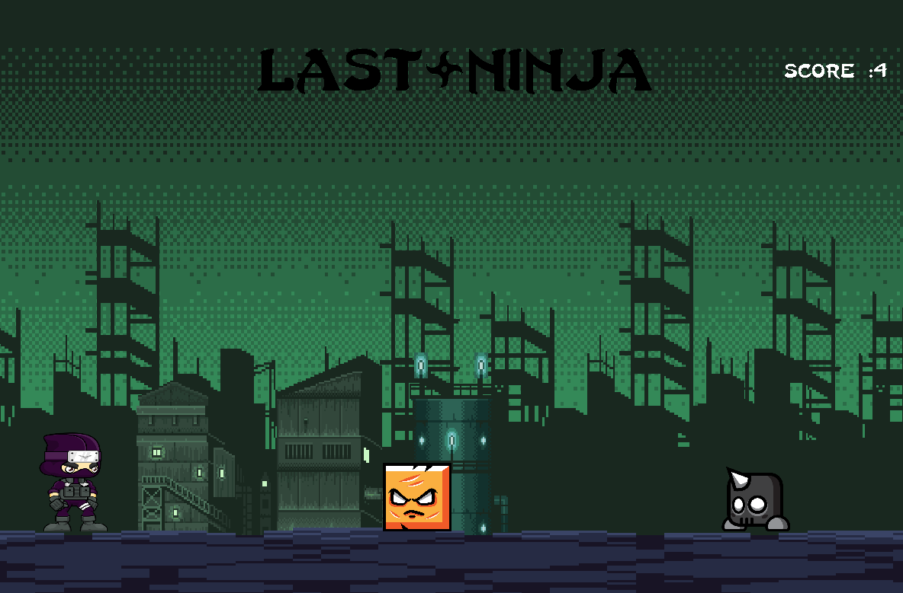
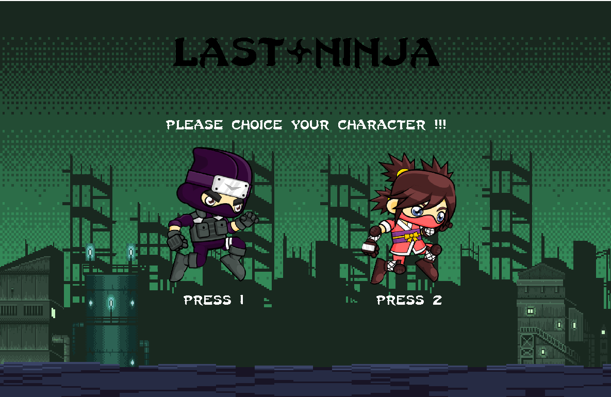
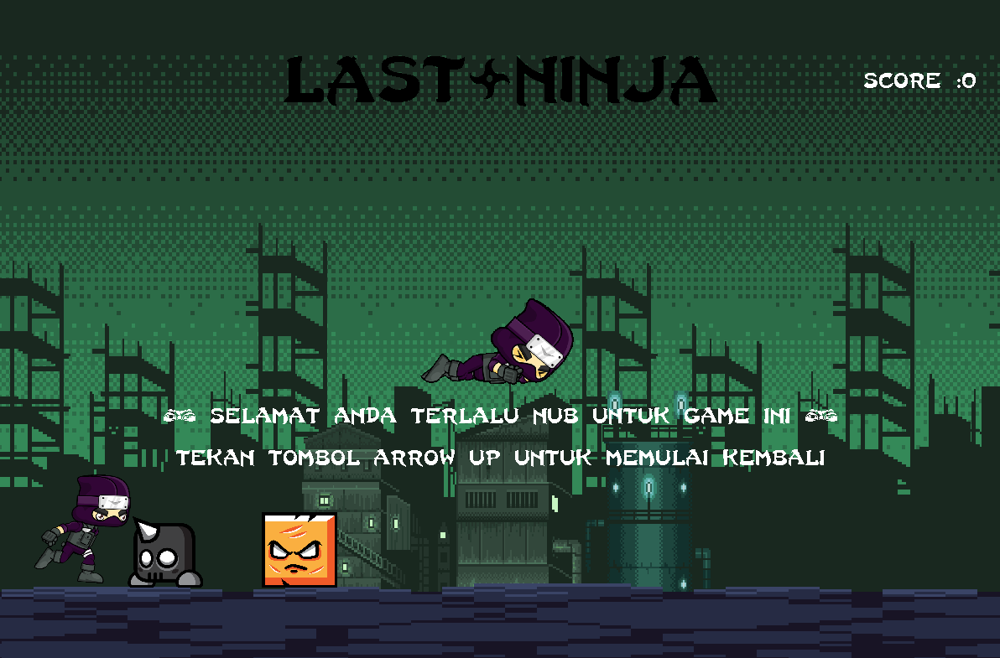
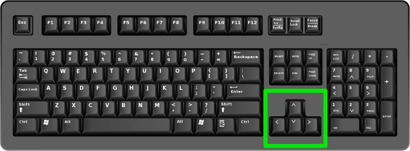
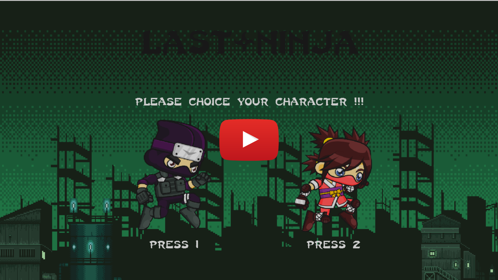

<h1 align="center">Last - Ninja </h1> <br>

<p align="center">
    
</p>
<p>
<p align="center"> Last - Ninja <br>
(Tugas Besar PBO RD-10) <br>
</p>
<p align="center">
    <a href="https://github.com/Chrisnico123/PBO/graphs/contributors">
    
  </a>
    <a href="https://www.pygame.org/news">
    
  </a>
</p>

<br>

## Description of Project

Proyek yang kami buat yaitu Proyek game sederhana bernama <b>Last - Ninja</b>, <b>Last - Ninja</b> adalah sebuah game yang berkonsep sama seperti game Dinosaurus yang ada di google chrome, jadi nanti ada sebuah character yang dapat digerakan oleh user, character dapat digerakan dengan cara menekan tombol panah atas untuk melompat dan panah bawah untuk menunduk, game ini endless play dimana user akan terus bermain dan skor akan terus bertambah hingga objek menabrak rintangan.

## How to Run a Game

- #### Install Dependecies

```bash
git clone https://github.com/Chrisnico123/PBO.git
```

```bash
cd PBO
```

```bash
pip install pygame
```

- ### Run a Game

```python
python main.py
```

<br>

<br>

## How to Run a Game in Docker (Linux)

<br>

### Step 1

Buka Terminal pada Linux anda masing-masing dan pastikan docker sudah terinstall di komputer anda.
<br>

### Step 2

Silahkan clone file game yang ada di Github dengan cara :
<br>
Syntax :

```bash
sudo git clone https://github.com/Chrisnico123/PBO.git
```

<br>

### Step 3

```bash
sudo docker build -t last-ninja .
```

### Step 4

Jalankan Perintah berikut ini:

```bash
XAUTH=$HOME/.Xauthority
```

```bash
touch $XAUTH
```

```bash
xhost +
```

```bash
xhost + username (username linux anda)
```

<br>

### Last Step

Run a Game

```bash
docker run -it -v /tmp/.X11-unix:/tmp/.X11-unix  -e DISPLAY=unix$DISPLAY --device /dev/snd mckriw/last-ninja
```

Or

```bash
sudo docker run -it -v /tmp/.X11-unix:/tmp/.X11-unix  -e DISPLAY=unix$DISPLAY --device /dev/snd mckriw/last-ninja
```

<br>

## How to Play a Game

- ### Start a Game

Berikut ini adalah gambar untuk panduan memulai Game <b> Last - Ninja</b>

  

- ### Game Play

Berikut ini adalah panduan untuk bermain <b> Last - Ninja</b>

Gameplay :

1. User pertama tama akan memilih karakter untuk dimainkan
2. Setelah itu user akan menekan tombol space untuk memulai game
3. Kemudian User akan menghindari rintangan yang ada kemudian mengumpulkan score yang banyak.

- ### End Game

Permainan akan berakhir apabila karakter menyentuh rintangan
<br>
Bisa dilihat pada gambar dibawah ini :
<br>



- ### Control in Game

Berikut adalah gambar untuk contoh control untuk menjalankan karakter.
<br>

<br>

1. Panah atas berguna untuk melompat
2. Panah bawah digunakan untuk menunduk

### Link Video YouTube

Untuk penjelasan dari perintah-perintah menjalankan game pygame di docker container dapat dilihat pada video dibawah ini.
<br>
Klik Gambar untuk menonton :)
<br>

[](https://www.youtube.com/watch?v=jGQQQT2IF7o&ab_channel=I2O14O244_ChrisnicoAlexanderHutapea)

## 🚀 About Team (Kelompok 10)

-Chrisnico Alexander Hutapea 120140244

-Iqbal Alfarizi 120140122

-Booby Julian Akbar 120140082

-Alfahmi Irfan 120140206

-Michael Pascalis Simanjuntak 120140137
